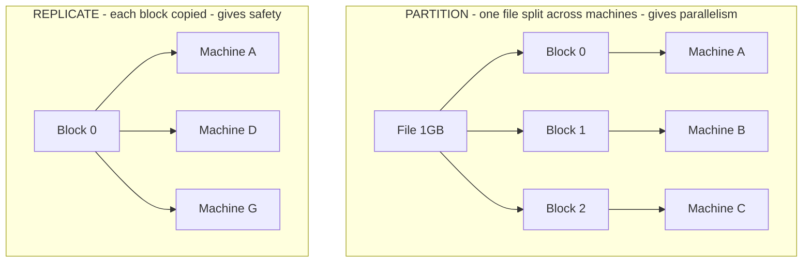
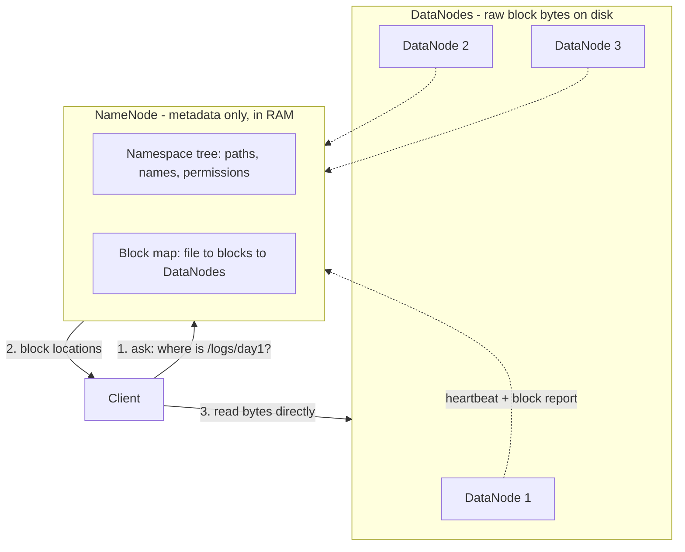

# Phase 0 — Requirements & Foundations · Learning Log

> Revision doc for the Requirements phase of Mini-HDFS. Every question asked,
> where I went wrong, the correct reasoning, the *why*, and interview one-liners.
> Read top-to-bottom to refresh; jump via the section list.
>
> Mermaid diagrams render on GitHub, in mermaid.live, or in VS Code with the
> "Markdown Preview Mermaid Support" extension.

## Contents
1. [Why HDFS exists](#1-why-hdfs-exists)
2. [Partition vs Replication (the two axes)](#2-partition-vs-replication)
3. [Deriving the 128 MB block size](#3-deriving-the-128-mb-block-size)
4. [The write-once model & immutability](#4-the-write-once-model--immutability)
5. [Metadata vs Data separation](#5-metadata-vs-data-separation)
6. [Functional Requirements recap](#6-functional-requirements-recap)
7. [Non-Functional Requirements recap](#7-non-functional-requirements-recap)
8. [Capacity estimation & the bottleneck](#8-capacity-estimation--the-bottleneck)
9. [Interview one-liner cheat sheet](#9-interview-one-liner-cheat-sheet)
10. [Interview question bank](#10-interview-question-bank)

---

## 1. Why HDFS exists

**Q asked:** "I have a laptop filesystem, a NAS box, a 20 TB disk. What does HDFS
solve that none of those do?"

**❌ My mistake:** I answered the *how* (splits into chunks, makes copies, uses
NameNode + DataNodes) instead of the *why*. I also said it "doesn't need much
infra, runs on a normal system" — wrong. And I only gave **one** reason a single
machine fails (fault tolerance).

**✅ Correct answer — a single machine has THREE ceilings:**

1. **Capacity** — datasets (petabytes) are bigger than any one machine's disks.
2. **Throughput** *(the killer, and the one I missed)* — one disk reads at
   ~100 MB/s. Reading 100 TB off one disk ≈ **11 days**, even if it fit. *Time*,
   not space, is the real wall.
3. **Failure** — one machine = one point of failure.

**The core insight:** spread data across N machines → read from all N **in
parallel** → 100 machines × 100 MB/s = **10 GB/s**. The 11-day read becomes
minutes. HDFS exists to get **combined capacity + combined disk bandwidth** from
many cheap (commodity) machines. Replication is the *tax* for going distributed
(more machines = something always broken), not the goal.

**Who runs it:** organizations doing large-scale **batch analytics** — process
years of logs / transactions / events. Classic job: "scan this entire 50 TB
dataset and compute over all of it" (the MapReduce workload HDFS feeds).

**NAS box** hits the same walls: capacity capped by one box, and *every* client's
reads funnel through *one* machine's bandwidth. It **scales up** (bigger box —
expensive, finite) instead of **scaling out** (more cheap boxes — cheap, ~unlimited).

> **One-liner:** *"HDFS stores datasets too big for one machine and reads them
> fast, by spreading data across many commodity machines to combine their
> capacity and disk bandwidth in parallel — with replication so the cluster
> tolerates constant failures."*

---

## 2. Partition vs Replication

**Q asked (follow-up):** "To read one file with parallelism, what must be
physically true about how it's stored?"

**❌ My mistake:** "Make copies and distribute them." That's **replication
again** — I collapsed two different concepts into one. Copies do NOT give parallel
reads.

**Counter-example that proves it:** a 1 GB file copied whole to machines A, B, C.
One client reads → picks one copy → one disk → ~10 s. B and C just sit there.
**Zero parallelism.**

**✅ The two independent axes:**

| | **Partitioning (split / stripe)** | **Replication** |
|---|---|---|
| What | Cut file into **blocks**, put **different** blocks on **different** machines | Make **copies** of each block on multiple machines |
| Buys | Capacity + **parallel throughput** | Fault tolerance |
| 1 GB file | 8 blocks × 128 MB on 8 machines | each block ×3 |

> **One-liner:** *"Partition for scale and speed; replicate for safety. They're
> orthogonal — HDFS does both."*

---

## 3. Deriving the 128 MB block size

**Q asked:** "Derive 128 MB. What breaks at 4 KB? At 10 GB? What's the trade-off?"

**✅ What I got right:** small blocks → many blocks per file → NameNode metadata
overhead. (1 GB as 4 KB blocks = 250,000 blocks.)

**❌ My mistake:** I claimed reading tiny blocks takes "about the same time" —
I forgot **disk seek time**.
- A disk must physically move its head to each block: **~10 ms per seek**.
- 8 blocks → 8 seeks → 80 ms (negligible).
- 250,000 blocks → 250,000 seeks → **~2,500 s (40+ min)** *just seeking*.
Seek overhead, not transfer, is what kills small blocks.

**Too big (10 GB blocks):**
- Lose parallelism (a 200 MB file = 1 block on 1 machine; 99 idle).
- Uneven load — block is also the unit of compute parallelism (≈1 block = 1 task).
- Expensive recovery — block is the unit of re-replication; a dead 10 GB block
  = 10 GB copied to heal.

**The trade-off axis:**
> Push block size **UP** to amortize per-block cost (seek + NameNode metadata).
> Push block size **DOWN** for finer parallelism + even load.

**The elegant derivation:**
> Choose block size so **seek time is ~1% of block read time.**
> Seek ≈ 10 ms → want read ≈ 1 s → at 100 MB/s → block = **~100 MB → 128 MB.**

Also: HDFS blocks are **logical** — a 5 MB file in a 128 MB block uses only 5 MB
on disk (no internal fragmentation, unlike a normal filesystem).

> **One-liner:** *"128 MB makes seek time a negligible fraction of transfer time,
> while staying small enough for good parallelism. Too small explodes NameNode
> memory and seek overhead; too big kills parallelism and makes recovery costly."*

---

## 4. The write-once model & immutability

**Q asked:** "Why does HDFS refuse in-place file edits? What would break?"

**Setup:** overwrite bytes 5,000,000–5,000,100 of a 10 GB file.

**❌ My mistake:** arithmetic — I said "block 40." Byte 5,000,000 = ~5 MB =
**block 0** (128 MB ≈ 134,000,000 bytes). Block 40 is at byte ~5.3 *billion*.
Always sanity-check units.

**✅ What I got right:** the block has 3 replicas → an edit needs all 3 updated →
if 2 succeed and a machine dies, replicas **disagree**.

**Sharpened consequence:** HDFS reads a block from **one** replica. After a
partial update: reader 1 hits replica A (new bytes), reader 2 hits replica C (old
bytes) → **same file, same offset, two different answers, no source of truth** =
**silent data corruption + non-deterministic reads.** To prevent it you'd need an
**atomic update across all 3 machines** (distributed transaction) on *every*
write — expensive and complex. Add concurrent writers → distributed locking too.

**❌ What I missed (point 4 — the real reason):** the **workload never needs it.**
HDFS serves **write-once, read-many** batch analytics: write a dataset once, scan
it many times. Nobody edits byte 5M of a log. So the designers **dropped a feature
the workload doesn't use to gain enormous simplicity.**

**What immutability (write-once) buys:**

| Because blocks never change after writing... | You get... |
|---|---|
| Replicas are identical copies of immutable data | Trivial consistency (no update coordination) |
| Replication = copy bytes | Dead-simple replication |
| Immutable data cached freely | Easy caching, no invalidation |
| No two clients overwrite same bytes | Simple concurrency (no write-locks) |
| Sequential write & read | Maximum throughput |

**Same principle powers:** Kafka (append-only log), LSM-trees / SSTables
(Cassandra, RocksDB), Git objects, copy-on-write filesystems, functional
programming.

**Production vs MVP:** real HDFS is "write-once **+ append**" (+ hflush/hsync).
Our MVP is write-once, **no append** (append adds lease + last-block-mutation
complexity → Phase 2).

> **One-liner:** *"HDFS is write-once because immutable data makes replication and
> consistency trivial and matches a write-once-read-many workload. Supporting
> random writes would need distributed atomic updates on every write — cost with
> no benefit for the workload."*

---

## 5. Metadata vs Data separation

The spine of the whole architecture: **the NameNode holds metadata; DataNodes
hold data.** They scale and fail independently.

Two mappings live in the NameNode (they behave differently):
1. **Namespace tree:** path/name → file. *(rename touches only this)*
2. **Block map:** file → blocks → DataNodes. *(rename does NOT touch this)*

**Why rename is O(1):** moving a 10 GB file copies **zero data bytes** — it edits
only mapping #1. A 10 GB rename and a 1 KB rename cost the same. Because it's
**atomic + O(1)**, rename is used as a **commit primitive** (write to temp path,
atomic rename to final → readers see old or fully-new, never partial).

> **One-liner:** *"Separating metadata (NameNode) from data (DataNodes) lets each
> scale and fail independently, and makes namespace ops like rename O(1) — no data
> moves."*

---

## 6. Functional Requirements recap

Write model: **write-once, whole-file.** No overwrite, no random write, no append
(Phase 2). The valuable part of an FR is the **failure/edge cases**.

| FR | Key failure/edge cases I initially missed |
|---|---|
| Create | client dies mid-write (lease); DataNode in pipeline dies (pipeline recovery) |
| Read | **ALL replicas dead → "missing block"** (metadata exists, data gone); one replica dead → retry another (not an error) |
| Delete | **metadata op**; block cleanup is **lazy/async** via heartbeats; non-empty dir needs recursive flag |
| Rename | pure metadata, atomic, O(1); reject if target exists / cycle |
| mkdir / ls | already-exists; path-not-found |

Full contracts live in [requirement.md](../requirement.md) §5.

> **Trap to remember:** in a distributed FS, **metadata and data can disagree** —
> the "file exists but all block replicas are dead" case has no equivalent on a
> laptop filesystem.

---

## 7. Non-Functional Requirements recap

**❌ Mistakes:** I said consistency was "No" (undersold) and that we optimize for
"many small operations" (wrong — HDFS is bad at that).

| NFR | Correct target |
|---|---|
| **Durability** | ×3 replication; block lost only if all 3 die within the re-replication window; self-healing. (Prod: rack awareness across fault domains.) |
| **Availability** | DataNode failures tolerated; **single NameNode = SPOF** → cluster unavailable if it dies. Data still durable, just unreachable. **durability ≠ availability.** |
| **Consistency** | **STRONG.** After close+min-replication, immediately readable, all readers see identical bytes. Invisible during write. |
| **Throughput** | High **sequential throughput** on large files; accept high per-op **latency**. NOT for many small ops. |
| **Scalability** | Storage/throughput scale out with DataNodes; **NameNode RAM is the ceiling.** |

**The killer pairing:** NFR-2 (SPOF) and NFR-3 (strong consistency) are the **same
decision** — the single NameNode is one source of truth (→ easy strong
consistency) *and* one thing that can die (→ SPOF). We chose consistency and paid
with availability (a **CP-leaning** choice).

---

## 8. Capacity estimation & the bottleneck

**Cluster:** 100 DataNodes × 10 TB, RF=3, 128 MB blocks, 1 GB avg file,
~150 B/metadata object.

| Step | Result |
|---|---|
| Raw disk | 100 × 10 = **1000 TB** |
| Usable (÷3) | **~333 TB** |
| # files (÷1 GB) | **~333,000** |
| Blocks/file (1 GB ÷ 128 MB) | **8** (not 7 — round-down check!) |
| Objects (files + blocks) | ~3–7 M |
| **NameNode RAM** | ~7M × 150 B ≈ **~1 GB** |

**❌ My mistake:** I called ~1 GB "a big number." It's **tiny** — servers have
128–256 GB. So here the **disk is the bottleneck, not the NameNode.**

**The real insight — bottleneck depends on file size** (NameNode RAM scales with
*number of objects*, NOT data volume):

| Same 333 TB stored as... | # files | NameNode RAM | Bottleneck |
|---|---|---|---|
| **1 GB** files | 333 K | **~1 GB** | Disk |
| **1 MB** files | 333 M | **~100 GB** 💥 | **NameNode RAM** |

Same data, **100× the RAM** → the **small-files problem**, quantified.

> **One-liner:** *"NameNode RAM scales with the number of files and blocks, not
> data volume — so large files are disk-bound (efficient) and small files are
> NameNode-memory-bound. HDFS is built for large files."*

---

## 9. Interview one-liner cheat sheet

- **Why HDFS:** combine capacity + disk bandwidth of many commodity machines;
  parallel reads beat one disk's ~100 MB/s wall.
- **Partition vs replicate:** partition for scale/speed, replicate for safety —
  orthogonal.
- **Block size:** 128 MB makes seek ~1% of transfer; too small → NameNode RAM +
  seeks; too big → no parallelism + costly recovery.
- **Write-once:** immutability makes replication + consistency trivial; matches
  write-once-read-many; random writes would need per-write distributed atomicity.
- **Metadata/data split:** independent scaling/failure; rename is O(1), no data moves.
- **Single NameNode:** one source of truth → strong consistency **and** SPOF (same
  decision); CP-leaning.
- **Bottleneck:** NameNode RAM scales with object count, not bytes → small-files
  problem.
- **durability ≠ availability**; **scale up vs scale out**; **throughput over latency**.

---

## 10. Interview question bank

Practice answering out loud, escalating in depth.

**Basic**
1. What problem does HDFS solve that a single big disk or NAS doesn't?
2. What's the difference between partitioning and replication?
3. Why 128 MB blocks and not 4 KB?
4. Why is HDFS write-once? Name one thing it buys you.
5. Where does metadata live vs data?

**Intermediate**
6. Reading a file, one replica of a block is down — what happens? Now all three?
7. Why is renaming a 10 GB file instant?
8. Why don't we log reads in the edit log?
9. Is HDFS strongly or eventually consistent? When is a written file visible?
10. Why is HDFS bad at storing millions of tiny files?

**Advanced / deep follow-ups**
11. A client overwrites bytes mid-file; the edit lands on 2 of 3 replicas, then a
    node dies. What does a reader see, and why is that unacceptable?
12. Your single NameNode gives strong consistency but is a SPOF — explain why
    those are the same design decision. Which CAP side does that lean?
13. Derive the NameNode RAM for 100 nodes × 10 TB, RF=3, with 1 GB files vs 1 MB
    files. Which resource runs out first in each case?
14. What would you change to remove the SPOF? (→ HA: standby NameNode, quorum
    journal, ZKFC, fencing — Phase 2.)
15. What breaks first as you keep adding DataNodes forever? (→ NameNode RAM →
    Federation.)

---

*End of Phase 0 learning log. Next: Phase 1 — High-Level Design.*
