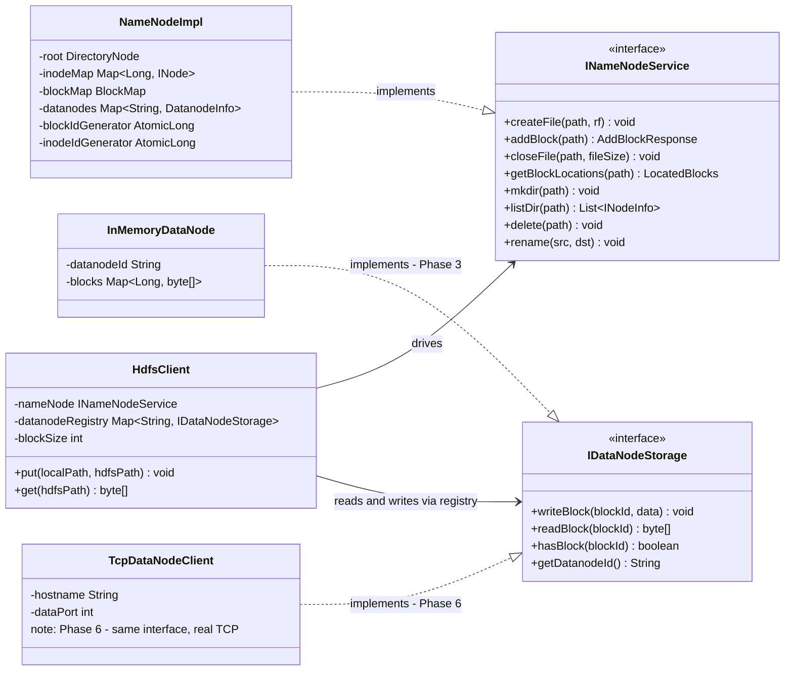
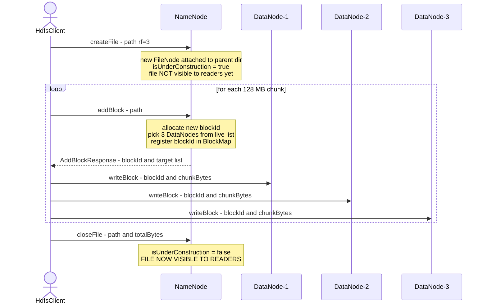
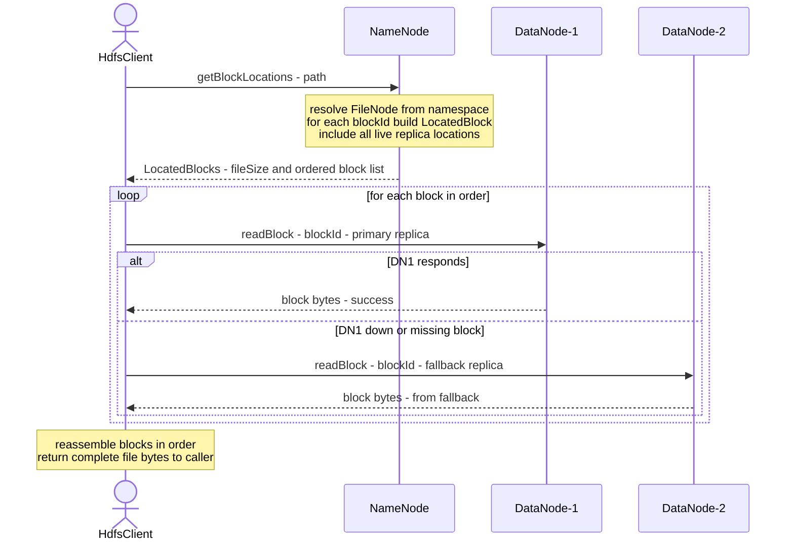

# Phase 3 — Walking Skeleton

> Goal: write a file end-to-end, read it back. Everything works together for the first time.
> No real networking yet. No disk persistence yet. But the architecture is real — the same
> interfaces that work in-memory will be backed by gRPC + TCP in Phase 6.

---

## Why "walking skeleton"?

A walking skeleton is the **thinnest slice that proves the whole architecture is alive.**
Not feature-complete. Not optimised. Just: all the pieces connect, data flows through
end-to-end, and you can verify correctness.

The biggest risk in Phase 3 is not performance or fault tolerance — it is: *does the
architecture actually compose correctly?* Can the Client drive the NameNode, get block
locations, stream bytes to DataNodes, and reassemble the file correctly? You prove this
before adding depth.

---

## The key architectural decision: in-JVM, interface-backed

**Same JVM. No real networking in Phase 3.**

Reason: networking is a separate problem (Phase 6). If you add gRPC + TCP sockets now,
you spend the next week debugging connection handling, serialization edge cases, and
port conflicts — not the distributed-systems logic. The walking skeleton isolates one
risk at a time.

**But the interfaces are real from day one.** The Client talks to:
- `INameNodeService` — not `NameNodeImpl` directly
- `IDataNodeStorage` — not `InMemoryDataNode` directly

In Phase 6, you drop in gRPC stubs and TCP clients that implement these same interfaces.
The Client code does not change. Only the backing implementation changes.

```
Phase 3 (in-memory):                    Phase 6 (networked):

Client                                   Client
  └── INameNodeService ◄──────────┐        └── INameNodeService ◄─── gRPC stub → NameNode process
        InMemoryNameNode           │              GrpcNameNodeClient
                                   │
  └── IDataNodeStorage ◄──────────┘        └── IDataNodeStorage ◄─── TCP client → DataNode process
        InMemoryDataNode                          TcpDataNodeClient

Same interfaces. Different impls. Client code unchanged.
```

This is the **Dependency Inversion principle** in practice — and also exactly how real
HDFS is structured (DFSClient → ClientProtocol interface, backed by an RPC proxy).

---

## Interface contracts (you implement these)

### INameNodeService.java
```java
public interface INameNodeService {

    // Write path
    void createFile(String path, short replicationFactor) throws IOException;
    AddBlockResponse addBlock(String path) throws IOException;
    void closeFile(String path, long fileSize) throws IOException;

    // Read path
    LocatedBlocks getBlockLocations(String path) throws IOException;

    // Namespace ops
    void mkdir(String path) throws IOException;
    List<INodeInfo> listDir(String path) throws IOException;
    void delete(String path) throws IOException;
    void rename(String src, String dst) throws IOException;
}
```

### IDataNodeStorage.java
```java
public interface IDataNodeStorage {
    void writeBlock(long blockId, byte[] data) throws IOException;
    byte[] readBlock(long blockId) throws IOException;
    boolean hasBlock(long blockId);
    String getDatanodeId();
}
```

### DTOs (pure data, no logic — Claude can scaffold these when you ask)
```java
// NameNode returns this on addBlock()
public record AddBlockResponse(
    long blockId,
    List<DatanodeDescriptor> targets   // which DNs to write to
) {}

// NameNode returns this on getBlockLocations()
public record LocatedBlocks(
    long fileSize,
    List<LocatedBlock> blocks          // ordered list
) {}

public record LocatedBlock(
    long blockId,
    long offset,                       // byte offset in the file
    long numBytes,                     // actual bytes in this block (last block may be < blockSize)
    List<DatanodeDescriptor> locations
) {}

public record DatanodeDescriptor(
    String datanodeId,
    String hostname,
    int dataPort                       // Phase 6: Client opens TCP here; Phase 3: unused
) {}

public record INodeInfo(
    String name,
    boolean isDirectory,
    long size,
    long modifiedAt
) {}
```

---

## Component implementations

### NameNodeImpl

Implements `INameNodeService`. Holds everything in RAM.

**State it must maintain:**
```java
private DirectoryNode root;                          // namespace tree root
private Map<Long, INode> inodeMap;                  // inodeId → INode
private BlockMap blockMap;                           // blockId ↔ datanodeId
private Map<String, DatanodeInfo> datanodes;        // datanodeId → DatanodeInfo
private AtomicLong blockIdGenerator;                // next block ID
private AtomicLong inodeIdGenerator;                // next inode ID
private final int defaultBlockSize = 128 * 1024 * 1024;  // 128 MB
```

**createFile logic:**
1. Split path into parent + filename (`/logs/day1.txt` → parent=`/logs`, name=`day1.txt`)
2. Resolve parent path in namespace tree → must be a DirectoryNode, must exist
3. Check no child named `day1.txt` already exists (no overwrite)
4. Create a new `FileNode`, attach to parent DirectoryNode
5. File is NOT visible to readers yet (visible only at closeFile)
6. Return OK

**addBlock logic:**
1. Resolve path → must be a FileNode that is being written (not yet closed)
2. Allocate new blockId from `blockIdGenerator`
3. Pick `replicationFactor` DataNodes from the live datanodes list
   - Phase 3 picking policy: round-robin or most-remaining-capacity
   - Phase 4+: rack-aware placement
4. Register the block in BlockMap (blockId → picked DataNodes)
5. Add blockId to FileNode.blockIds
6. Return AddBlockResponse(blockId, List<DatanodeDescriptor>)

**closeFile logic:**
1. Resolve path → FileNode
2. Set fileSize
3. Mark file as closed/visible (a simple boolean flag `isUnderConstruction = false`)
4. Done — file is now readable

**getBlockLocations logic:**
1. Resolve path → FileNode (must be closed)
2. For each blockId in FileNode.blockIds (in order):
   - Look up locations in BlockMap
   - Build LocatedBlock (blockId, offset, numBytes, locations)
   - Accumulate offset (offset += prev block's numBytes)
3. Return LocatedBlocks(fileSize, orderedList)

**DataNode selection (Phase 3 simple policy):**
```java
// Pick 'replicationFactor' DataNodes from live list
// Simple: shuffle and take first RF nodes
List<DatanodeInfo> available = new ArrayList<>(datanodes.values());
Collections.shuffle(available);
return available.subList(0, replicationFactor);
```

---

### InMemoryDataNode

Implements `IDataNodeStorage`. Stores bytes in a HashMap.

```java
public class InMemoryDataNode implements IDataNodeStorage {
    private final String datanodeId;
    private final Map<Long, byte[]> blocks = new ConcurrentHashMap<>();

    public void writeBlock(long blockId, byte[] data) {
        blocks.put(blockId, data.clone());  // defensive copy
    }

    public byte[] readBlock(long blockId) throws IOException {
        byte[] data = blocks.get(blockId);
        if (data == null) throw new IOException("Block " + blockId + " not found");
        return data.clone();
    }

    public boolean hasBlock(long blockId) {
        return blocks.containsKey(blockId);
    }
}
```

**Why `data.clone()`?** The byte array passed in might be reused by the caller (common in
streaming code). Defensive copy prevents silent data corruption — a subtle bug that would
be very hard to debug.

---

### HdfsClient

The Client is the most complex component. It orchestrates everything.

**Constructor — takes the interfaces, not the implementations:**
```java
public class HdfsClient {
    private final INameNodeService nameNode;
    private final Map<String, IDataNodeStorage> datanodeRegistry;  // datanodeId → storage
    private final int blockSize;

    // Phase 3: caller wires in InMemoryDataNode instances
    // Phase 6: caller wires in TcpDataNodeClient instances
}
```

**Write a file (put):**
```java
public void put(String localPath, String hdfsPath) throws IOException {
    byte[] fileData = Files.readAllBytes(Path.of(localPath));
    nameNode.createFile(hdfsPath, replicationFactor=3);

    int offset = 0;
    while (offset < fileData.length) {
        int chunkEnd = Math.min(offset + blockSize, fileData.length);
        byte[] chunk = Arrays.copyOfRange(fileData, offset, chunkEnd);

        AddBlockResponse resp = nameNode.addBlock(hdfsPath);
        // write chunk to each replica
        for (DatanodeDescriptor dn : resp.targets()) {
            IDataNodeStorage storage = datanodeRegistry.get(dn.datanodeId());
            storage.writeBlock(resp.blockId(), chunk);
        }

        offset = chunkEnd;
    }

    nameNode.closeFile(hdfsPath, fileData.length);
}
```

**Read a file (get):**
```java
public byte[] get(String hdfsPath) throws IOException {
    LocatedBlocks located = nameNode.getBlockLocations(hdfsPath);
    ByteArrayOutputStream result = new ByteArrayOutputStream((int) located.fileSize());

    for (LocatedBlock block : located.blocks()) {
        byte[] blockData = readBlockWithFallback(block);
        result.write(blockData);
    }

    return result.toByteArray();
}

private byte[] readBlockWithFallback(LocatedBlock block) throws IOException {
    for (DatanodeDescriptor dn : block.locations()) {
        IDataNodeStorage storage = datanodeRegistry.get(dn.datanodeId());
        if (storage != null && storage.hasBlock(block.blockId())) {
            try {
                return storage.readBlock(block.blockId());
            } catch (IOException e) {
                // this replica failed — try next
            }
        }
    }
    throw new IOException("All replicas failed for block " + block.blockId());
}
```

The fallback loop is the **fault tolerance** for reads: if DN1 is down, try DN2, then DN3.
In Phase 5 (heartbeats), the NameNode will proactively remove dead DNs from BlockMap.
In Phase 3, we simulate failure by simply not registering a DN in the registry.

---

## End-to-end flow (text diagram)

### Write path
```
HdfsClient.put("local.txt", "/logs/day1.txt")
│
├── nameNode.createFile("/logs/day1.txt", rf=3)
│     NameNode: new FileNode("day1.txt"), attach to /logs
│     FileNode.isUnderConstruction = true
│
├── [loop: for each 128MB chunk]
│   │
│   ├── nameNode.addBlock("/logs/day1.txt")
│   │     NameNode: allocate blockId=101
│   │     NameNode: pick DN1, DN2, DN3
│   │     NameNode: register 101 → {DN1,DN2,DN3} in BlockMap
│   │     NameNode: add 101 to FileNode.blockIds
│   │     return AddBlockResponse(101, [DN1,DN2,DN3])
│   │
│   └── for each target DN:
│         datanodeRegistry.get("dn-1").writeBlock(101, chunkBytes)
│         datanodeRegistry.get("dn-2").writeBlock(101, chunkBytes)
│         datanodeRegistry.get("dn-3").writeBlock(101, chunkBytes)
│
└── nameNode.closeFile("/logs/day1.txt", totalBytes)
      FileNode.isUnderConstruction = false
      File is now visible to readers
```

### Read path
```
HdfsClient.get("/logs/day1.txt")
│
├── nameNode.getBlockLocations("/logs/day1.txt")
│     resolve path → FileNode
│     for each blockId in FileNode.blockIds:
│       look up BlockMap → {DN1, DN2, DN3}
│       build LocatedBlock(blockId, offset, numBytes, locations)
│     return LocatedBlocks(fileSize=300MB, [block101, block102, block103])
│
└── for each LocatedBlock:
      try DN1.readBlock(blockId) → bytes    ← first try
      on failure: try DN2.readBlock(blockId) ← fallback
      on failure: try DN3.readBlock(blockId) ← last resort
      append bytes to result buffer

return assembled byte[]  (must equal original file bytes)
```

---

## DataNode registration (simplified for Phase 3)

In Phase 5, DataNodes register via gRPC heartbeat. In Phase 3, the caller wires them
manually. But the NameNode still needs to know about DataNodes to pick placement targets.

```java
// NameNode exposes this for Phase 3 setup only
public void registerDatanode(DatanodeInfo info) {
    datanodes.put(info.datanodeId(), info);
}
```

Bootstrap code in your test or main:
```java
// Create components
NameNodeImpl nameNode = new NameNodeImpl();
InMemoryDataNode dn1 = new InMemoryDataNode("dn-1");
InMemoryDataNode dn2 = new InMemoryDataNode("dn-2");
InMemoryDataNode dn3 = new InMemoryDataNode("dn-3");

// Register DNs with NameNode (in Phase 5: DataNodes do this themselves via heartbeat)
nameNode.registerDatanode(new DatanodeInfo("dn-1", "localhost", 50010, 10_000_000_000L));
nameNode.registerDatanode(new DatanodeInfo("dn-2", "localhost", 50011, 10_000_000_000L));
nameNode.registerDatanode(new DatanodeInfo("dn-3", "localhost", 50012, 10_000_000_000L));

// Build client registry
Map<String, IDataNodeStorage> registry = Map.of(
    "dn-1", dn1,
    "dn-2", dn2,
    "dn-3", dn3
);

// Wire client
HdfsClient client = new HdfsClient(nameNode, registry, blockSize=4*1024*1024);
```

---

## Maven module layout for Phase 3

```
mini-hdfs/
  pom.xml                   (parent)
  hdfs-common/
    src/main/java/
      model/
        INode.java           (abstract class)
        FileNode.java
        DirectoryNode.java
        BlockMap.java
        DatanodeInfo.java
      dto/
        AddBlockResponse.java
        LocatedBlocks.java
        LocatedBlock.java
        DatanodeDescriptor.java
        INodeInfo.java
  hdfs-namenode/
    src/main/java/
      INameNodeService.java
      NameNodeImpl.java
    src/test/java/
      NameNodeTest.java
  hdfs-datanode/
    src/main/java/
      IDataNodeStorage.java
      InMemoryDataNode.java
  hdfs-client/
    src/main/java/
      HdfsClient.java
    src/test/java/
      EndToEndTest.java      ← the most important test
```

---

## Task breakdown (closeable tasks — each fits one sitting)

### Task 1 — Maven multi-module skeleton
**Done when:** `mvn compile` succeeds from parent with all 4 modules. No logic yet.

### Task 2 — Model classes (from LLD)
**Done when:** `INode`, `FileNode`, `DirectoryNode`, `BlockMap`, `DatanodeInfo` compile.
Composite pattern. Unit test: create directory tree `/logs/day1.txt` using only these
classes, resolve path, assert correct INode type returned.

### Task 3 — DTOs
**Done when:** all record types compile (`AddBlockResponse`, `LocatedBlocks`, etc.).
Claude can scaffold these — no design thinking, just data carriers.

### Task 4 — Interfaces
**Done when:** `INameNodeService` and `IDataNodeStorage` compile with all method signatures.

### Task 5 — NameNodeImpl (write path only)
**Done when:** `createFile` + `addBlock` + `closeFile` work.
Unit test: create `/a/b.txt`, call addBlock twice, call closeFile. Assert FileNode has 2
blockIds. Assert BlockMap has both blockIds mapped to 3 DNs each.

### Task 6 — NameNodeImpl (read path + namespace ops)
**Done when:** `getBlockLocations`, `mkdir`, `listDir`, `delete`, `rename` work.
Unit test per method. Rename test: assert blockIds unchanged after rename.

### Task 7 — InMemoryDataNode
**Done when:** writeBlock + readBlock + hasBlock work, with defensive copies.
Unit test: write bytes, read back, assert equal. Write same blockId twice (should
overwrite? or throw?). Decide and test that decision.

### Task 8 — HdfsClient (write + read)
**Done when:** `put` and `get` work end-to-end in-memory.

### Task 9 — End-to-end test (the Phase 3 done-state)
See below.

---

## Done state — Phase 3 complete when these tests pass

### Test 1: basic write and read
```
1. Bootstrap: 3 InMemoryDataNodes, NameNodeImpl, HdfsClient
2. client.put("test-data/hello.txt", "/hello.txt")
3. byte[] result = client.get("/hello.txt")
4. Assert: result equals original file bytes exactly
```

### Test 2: multi-block file
```
1. Use blockSize = 1 MB (small, so tests run fast)
2. Generate 5 MB of random bytes as "file data"
3. client.put(5MB data, "/big.txt")
4. Assert NameNode shows FileNode with 5 blockIds
5. Assert each block replicated on exactly 3 DataNodes
6. byte[] result = client.get("/big.txt")
7. Assert: result equals original 5 MB exactly (byte-for-byte)
```

### Test 3: fault tolerance — one DataNode down
```
1. Write file with RF=3 → blocks on DN1, DN2, DN3
2. Simulate DN1 failure: remove "dn-1" from client's datanodeRegistry
   (Phase 3 simulation — no real failure detection yet)
3. client.get("/hello.txt")
4. Assert: succeeds (read falls back to DN2 or DN3)
5. Assert: returned bytes still equal original
```

### Test 4: namespace operations
```
1. nameNode.mkdir("/logs")
2. client.put(data, "/logs/day1.txt")
3. client.put(data, "/logs/day2.txt")
4. List<INodeInfo> entries = nameNode.listDir("/logs")
5. Assert: 2 entries, both files
6. nameNode.rename("/logs/day1.txt", "/logs/day1-archived.txt")
7. byte[] result = client.get("/logs/day1-archived.txt")
8. Assert: bytes equal original (rename moved metadata, not data)
9. nameNode.delete("/logs/day2.txt")
10. Assert: getBlockLocations("/logs/day2.txt") throws FileNotFoundException
```

---

## What is deferred (do NOT build in Phase 3)

| Deferred | When | Why |
|---|---|---|
| gRPC + TCP networking | Phase 6 | Separate concern; same interfaces, new impls |
| Disk persistence (DataNode) | Phase 6 | InMemoryDataNode is sufficient |
| Edit log + fsimage | Phase 7 | NameNode restart recovery |
| Heartbeats / failure detection | Phase 5 | Phase 3 simulates failure manually |
| Rack-aware placement | Phase 4 | Phase 3: round-robin or shuffle |
| Write pipeline (client → DN1 → DN2 → DN3) | Phase 6 | Phase 3: client writes to all DNs directly |
| Checksums / corruption detection | Phase 6+ | Phase 3: trust the bytes |

---

## Common interview questions for Phase 3

**Q: Why use interfaces between components instead of direct class references?**
A: Interface = seam. You can swap the implementation without changing the caller. In Phase 3
the seam is backed by in-memory objects. In Phase 6, the same seam is backed by network
clients. The Client code is identical in both phases. This is Dependency Inversion —
and it is also how real HDFS is structured (DFSClient talks to a ClientProtocol interface,
backed by a generated RPC proxy).

**Q: Why is the file invisible until closeFile?**
A: Write-once semantics. If readers could see a partially-written file, they would read
incomplete data (missing blocks, partial last block). By buffering visibility until close,
the NameNode guarantees readers always see a complete, consistent file. Also: if the writer
crashes before closeFile, the file can be cleaned up without exposing corrupt state.
This is the same reason Kafka log segments and LSM-tree SSTables are write-once.

**Q: You said blockSize = 1 MB in tests. Why not 128 MB?**
A: A test with 5 × 128 MB = 640 MB of random bytes in memory is slow and wastes heap.
Block size is a configuration parameter — the distributed-systems logic is identical at
any size. Tests use small blocks; production uses 128 MB. Always make such parameters
configurable, never hardcoded.

**Q: In your put() method, you write each chunk to all replica DataNodes. In real HDFS the
client only writes to the first DataNode in the pipeline. Why?**
A: In real HDFS, the write pipeline (client → DN1 → DN1 forwards → DN2 → DN2 forwards → DN3)
conserves client-side network bandwidth — the client sends 1× the data, not RF×. In Phase 3,
we write directly to all DNs because there's no real network — method calls have no bandwidth
cost. Phase 6 replaces this with a real pipeline. The correctness is identical; only the
network efficiency differs. (This is the MVP/Production trade-off to state explicitly in
an interview.)

**Q: Your fault-tolerance test simulates failure by removing a DN from the registry. What
does a real system do instead?**
A: The NameNode detects the dead DataNode via missed heartbeats (Phase 5). It updates the
BlockMap to remove that DataNode from all block locations. The client gets the updated
locations on getBlockLocations — the dead DN is already gone. No client-side simulation
needed; the NameNode handles it. Phase 3 short-circuits this by directly removing from
the client registry, which gives the same behaviour without the heartbeat machinery.

**Q: What happens if the client crashes between addBlock and closeFile?**
A: The file stays `isUnderConstruction = true` forever — a lease leak. In real HDFS, the
NameNode runs a lease monitor: if a file has been under construction too long with no
activity, it forcibly closes or abandons it (lease recovery). In our MVP: the file stays
stuck. Phase 2+ would add lease timeouts. State it as a known limitation.

---

## Diagrams

### 1. Class diagram — interfaces as seams



> The interfaces are the seams. In Phase 3, `InMemoryDataNode` sits behind `IDataNodeStorage`.
> In Phase 6, swap in `TcpDataNodeClient` — `HdfsClient` code does not change.

---

### 2. Sequence diagram — write path



> Phase 3: Client writes to all replicas directly — no real network cost.
> Phase 6: replace with pipeline — Client writes to DN1 only, DN1 forwards to DN2, DN2 to DN3.

---

### 3. Sequence diagram — read path with fallback



> Fault tolerance: if the primary replica is unavailable, the Client tries the next location
> in the list. With RF=3 there are always 2 fallback replicas. Phase 5 will have the
> NameNode proactively prune dead DataNodes from block locations via heartbeat detection.
