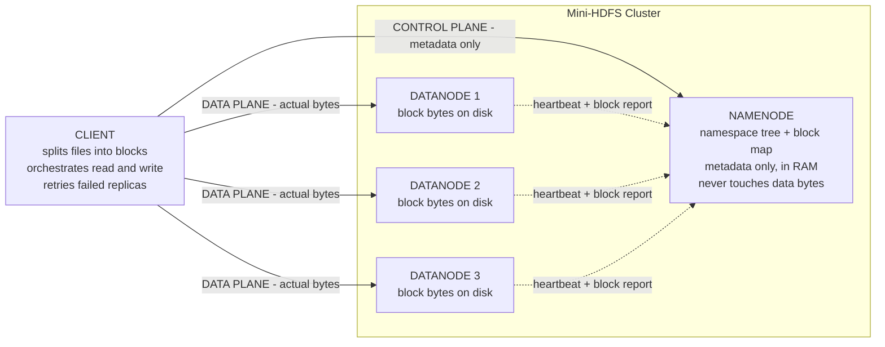
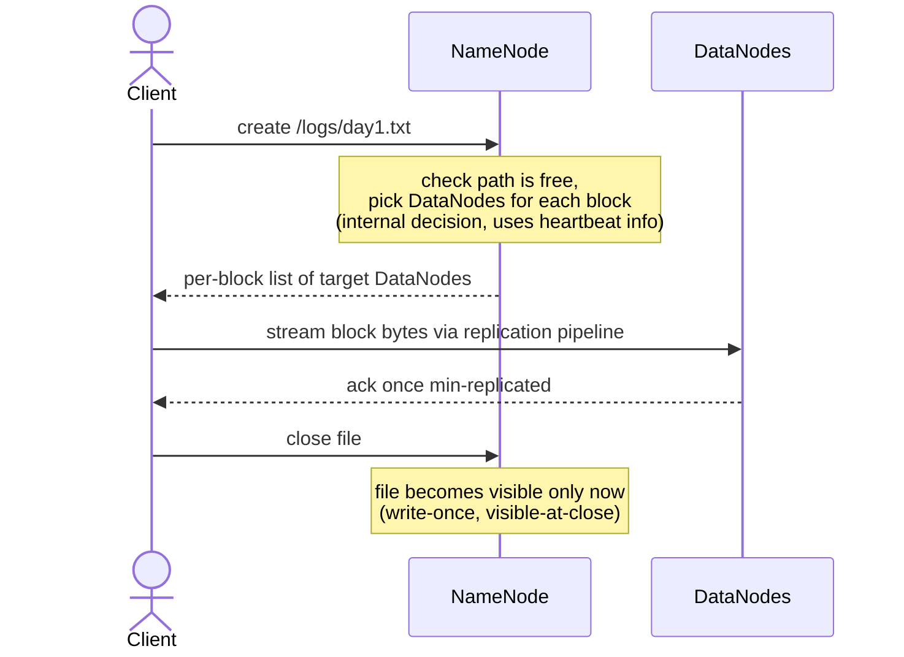
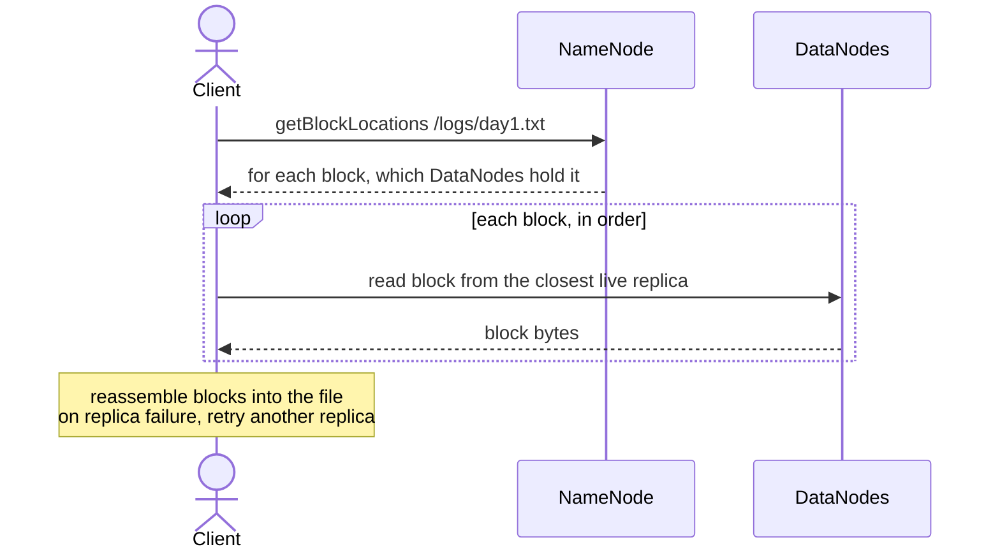

# HLD — Architecture & Core Flows (Mini-HDFS)

> High-level design: the three components, the **control-plane / data-plane
> separation**, and the read/write/heartbeat flows. Diagrams render on GitHub and
> in mermaid.live. Corrected from the first sequence sketch (heartbeat direction,
> allocation as an internal NameNode decision, NameNode never serves data).

## The one idea to hold

**Metadata and data travel on different paths.**
- **Control plane** = Client ↔ NameNode (small, cheap: "where are the blocks?").
- **Data plane** = Client ↔ DataNodes (huge, bandwidth-heavy: the actual bytes).
- **The NameNode is never in the data path** — that's what lets one NameNode
  coordinate a thousand DataNodes moving petabytes.
- **DataNodes always initiate** talking to the NameNode (heartbeats, block
  reports). The NameNode never calls a DataNode directly; it piggybacks commands
  on heartbeat *replies*.

---

## 1. Component architecture



Solid arrows = per-request. Dotted arrows = background/periodic, always
DataNode-initiated.

---

## 2. Write path (write-once)

Client asks the NameNode *where* to write, then streams bytes **directly** to the
DataNodes. The NameNode only hands back a list — it never receives the data.



Key points: allocation is the NameNode's **internal** choice (no call to a
DataNode); data flows Client → DataNodes only; the file is invisible until close.

---

## 3. Read path

Client asks the NameNode for block **locations**, then reads bytes **directly**
from DataNodes, reassembling in order. Tries another replica if one is down.



Key points: the NameNode returns **locations, not data**; parallel-friendly
because different blocks live on different DataNodes.

---

## 4. Background — heartbeats & block reports (always DataNode-initiated)

Not part of any client request. This is how the NameNode knows who is alive and
what blocks exist, and how it sends commands back.

```mermaid
sequenceDiagram
    participant DN as DataNode
    participant NN as NameNode

    loop every few seconds
        DN->>NN: heartbeat (I am alive, capacity, load)
        NN-->>DN: reply may carry commands<br/>(replicate block X, delete block Y)
    end
    loop periodically
        DN->>NN: block report (full list of blocks I hold)
        Note over NN: reconcile block map;<br/>detect under / over-replication
    end
```

Key points: DataNode **always** initiates; the NameNode issues commands **only**
as replies to heartbeats — it never opens a connection to a DataNode.

---

## Corrections captured (from the first sketch)
- Heartbeat direction is **DataNode → NameNode**, not the reverse; and it is
  background, not part of the client-op flow.
- "allocate datanode" is an **internal NameNode decision**, not a call to a
  DataNode — so there is **no NameNode → DataNode arrow** during a client write.
- The NameNode **never provides file data** — only metadata/locations. Data comes
  from DataNodes.
- **Read and write are separate flows** — drawn separately above.
