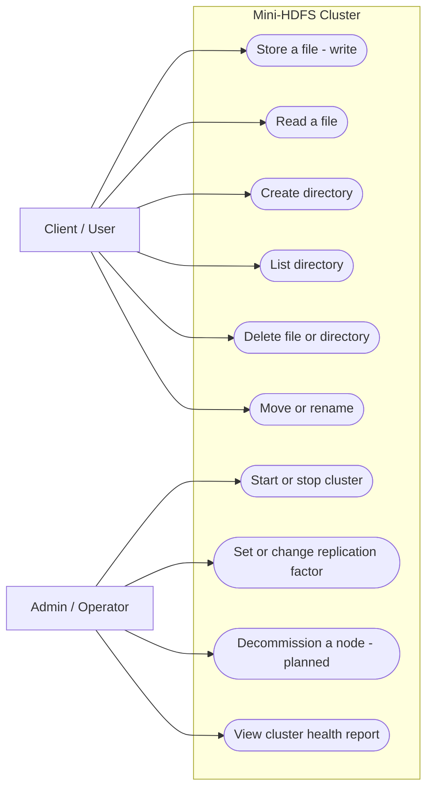

# Use-Case Diagram — Mini-HDFS

Actors (outside the system) and the goals they accomplish through it.
Boundary = the whole cluster, so NameNode/DataNode are *inside* (components),
not actors.



## Syntax cheat-sheet (learn this — next diagram is yours)

- ` ```mermaid ` … ` ``` ` — the fenced block that tells the renderer "this is a diagram."
- `flowchart LR` — a flowchart, laid out **L**eft-to-**R**ight (`TD` = top-down).
- `name["text"]` — a **box** node (used here for actors). `name` is the id you
  reference later; `"text"` is the label.
- `name(["text"])` — a **stadium/oval** node (used here for use cases).
- `subgraph X["Label"] ... end` — draws a **box around** everything inside =
  the system boundary.
- `a --> b` — an arrow (interaction) from `a` to `b`.
- `%% comment` — a comment, ignored by the renderer.

**Gotcha:** avoid `(` `)` and ` / ` *inside* node labels — many renderers choke
on them even when quoted. Use `-`, `or`, or `and` instead. This is the #1 cause
of "why won't my diagram render."

That's ~90% of the Mermaid you'll ever need. The rest (sequence, class diagrams)
reuses the same ideas.
